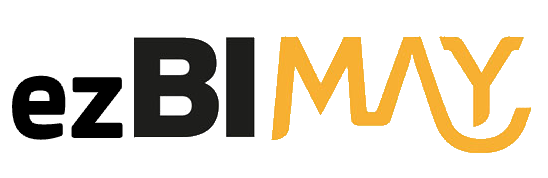

# What is EzBimay
Have you ever wished to use Binus Maya a lot easier like it should be? well, look no further because EzBimay is here to 
make your life a lot easier with cool wicked features and consume much less time with Binus Maya.

---

## Features
- Automatically open Binus Maya on default browser.
- Instant login.
- In just one click you can:
   - View Grades/Score
   - View Exam Schedule
   - Submit assignment
- Always on sync outlook calendar with Binus Maya calendar.
- Exam schedule on outlook calendar.
- Assignment due time on outlook calendar.

---

## Installation
- **Safari**
   - Safari -> Preferences -> Advanced -> "Show Develop menu in menu bar"
   - Develop -> "Allow Remote Automation"
- Install JDK 1.8u212
- Download latest <a href="https://github.com/savageRex/EzBimay/releases/latest/download/EzBimay.jar" target="_blank">`release`</a>
- Double click the .jar file

---

## FAQ

- **What OS is currently supported?**
    - macOS
    
- **What Browser is currently supported?**
    - Google Chrome ***(Default)***
    - Safari ***(Very limited support)***
    
- **What happen if I don't have Google Chrome?**
   - You will use the built in browser that came with your OS.
    
- **What happen if I use a very limited support browser?**
   - Some of the features will guaranteed to be not working.

- **Why Binus Maya is so slow?**
   - Maybe your internet connection speed is slow or Binus Maya server is crowded.
   
- **Why Binus Maya won't open?**
   - Check your internet connection or maybe Binus Maya server is currently down.
---

## Support

Have a suggestion or want to report a problem?

- <a href="mailto:eris77cool@gmail.com" target="_blank">`Here`</a> is my email.
- DM me on <a href="http://instagram.com/eris.ky" target="_blank">`instagram`</a>

---

## Author
* **Eris Suryaputra** - *Creator, Designer, Programmer, Tester* - [savageRex](https://github.com/savageRex)

---

## Disclaimer
Binus Maya is owned by Binus.
